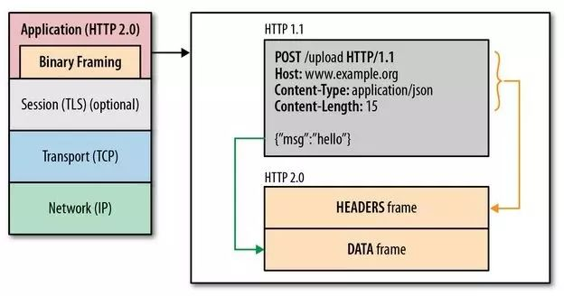

## Http 缓存

### 步骤

- 当浏览器要请求资源时(有缓存)：

1. 调用 Service Worker 的 fetch 事件响应
2. 查看 memory cache
3. 查看 disk cache：
    - 如果有强制缓存且未失效，则使用强制缓存，不请求服务器。这时的状态码全部是 200
    - 如果有强制缓存但已失效，使用对比缓存，比较后确定 304 还是 200

- 无缓存：
1. 发送网络请求，等待网络响应
2. 把响应内容存入 disk cache (如果 HTTP 头信息配置可以存的话)
3. 把响应内容 的引用 存入 memory cache (无视 HTTP 头信息的配置)
4. 把响应内容存入 Service Worker 的 Cache Storage (如果 Service Worker 的脚本调用了 cache.put  ())

### 状态码
- 200 form memory cache：
不访问服务器，一般已经加载过该资源且缓存在了内存当中，直接从内存中读取缓存。浏览器关闭后，数据将不存在（资源被释放掉了），再次打开相同的页面时，不会出现from memory cache。一般脚本、字体、图片会存在内存当中

- 200 from disk cache：
不访问服务器，已经在之前的某个时间加载过该资源，直接从硬盘中读取缓存，关闭浏览器后，数据依然存在，此资源不会随着该页面的关闭而释放掉下次打开仍然会是from disk cache。一般非脚本会存在内存当中，如css等

- 304 Not Modified：
访问服务器，发现数据没有更新，服务器返回此状态码。然后从缓存中读取数据。


### 强缓存
- Expires

    HTTP/1.0 的标准，缓存过期的时间，超过了这个时间点就代表资源过期

- Cache-Control

     HTTP/1.1 的标准，由多个字段组合而成
     
     - max-age： 指定一个时间长度，在这个时间段内缓存是有效的，单位是s
     - no-cache： 强制所有缓存了该响应的用户，在使用已缓存的数据前，发送带验证器的请求到服务器。
     - no-store： 禁止缓存，每次请求都要向服务器重新获取数据
     <br>
     <br>
     


### 协商缓存
&nbsp;&nbsp;当强制缓存失效(超过规定时间)时，就需要使用对比缓存，由服务器决定缓存内容是否失效。

- Last-Modified & If-Modified-Since

    1. 服务器通过 Last-Modified 字段告知客户端，资源最后一次被修改的时间，例如
    Last-Modified: Mon, 10 Nov 2018 09:10:11 GMT

    2. 浏览器将这个值和内容一起记录在缓存数据库中。

    3. 下一次请求相同资源时时，浏览器从自己的缓存中找出“不确定是否过期的”缓存。因此在请求头中将上次的 Last-Modified 的值写入到请求头的 If-Modified-Since 字段

    4. 服务器会将 If-Modified-Since 的值与 Last-Modified 字段进行对比。如果相等，则表示未修改，响应 304；反之，则表示修改了，响应 200 状态码，并返回数据。

- Etag & If-None-Match

    Etag 存储的是文件的特殊标识(一般都是 hash 生成的)，服务器存储着文件的 Etag 字段。之后的流程和 Last-Modified 一致，只是 Last-Modified 字段和它所表示的更新时间改变成了 Etag 字段和它所表示的文件 hash，把 If-Modified-Since 变成了 If-None-Match。服务器同样进行比较，命中返回 304, 不命中返回新资源和 200。


### sevice worker
Service workers 本质上充当 Web 应用程序、浏览器与网络（可用时）之间的代理服务器。这个 API 旨在创建有效的离线体验，它会拦截网络请求并根据网络是否可用采取来适当的动作、更新来自服务器的的资源。它还提供入口以推送通知和访问后台同步 API。[(MDN)](https://developer.mozilla.org/zh-CN/docs/Web/API/Service_Worker_API)

### 浏览器的行为

&nbsp;&nbsp;所谓浏览器的行为，指的就是用户在浏览器如何操作时，会触发怎样的缓存策略。主要有 3 种：

- 打开网页，地址栏输入地址： 查找 disk cache 中是否有匹配。如有则使用；如没有则发送网络请求。
- 普通刷新 (F5)：因为 TAB 并没有关闭，因此 memory cache 是可用的，会被优先使用(如果匹配的话)。其次才是 disk cache。
- 强制刷新 (Ctrl + F5)：浏览器不使用缓存，因此发送的请求头部均带有 Cache-control: no-cache(为了兼容，还带了 Pragma: no-cache)。服务器直接返回 200 和最新内容。


## 了解http2.0吗？

HTTP/1.1存在的问题：

1. 线头阻塞，TCP连接上只能发送一个请求，前面点请求未完成前，后续的请求需要排队等待。
2. 多个TCP连接，HTTP/1.1管线化可以支持请求并发，但是浏览器很难实现。
3. 头部冗余，采用文本格式，首部未压缩（cookie、user-agent等相同字段重复发送）
4. 客户端需要主动请求

HTTP/2.0的特点：

1. 二进制分帧层：一条HTTP响应划分为两个帧[ HEADERS（首部）和DATA（消息负载）]来传输，并采用二进制来编码 
2. 多路复用：HTTP2让所有的通信都在一个TCP连接上完成，实现请求并发.HTTP2建立一个TCP连接，一个连接上面可以有任意多个流（stream），消息分割成一个或多个帧在流里面传输。帧传输过去以后，再进行重组，形成一个完整的请求或响应。这使得所有的请求或响应都无法阻塞 
3. 头部压缩：http/2使用encoder来减少需要传输的header大小，通讯双方各自缓存一份头部字段表，既避免了重复header的传输，又减小了需要传输的大小。
4. 服务器端推送：服务器可以对一个客户端请求发送多个响应，省去了客户端重复请求的步骤。

 

## get请求和post请求的区别？
- ```请求参数```：GET请求参数是通过URL传递的，多个参数以&连接，POST请求放-在request body中。
- ```安全性```：POST比GET安全，GET请求在浏览器回退时是无害的，而POST会再次请求。
- ```历史记录```：GET请求参数会被完整保留在浏览历史记录里，而POST中的参数-不会被保留。
- ```编码方式```：GET请求只能进行url编码，而POST支持多种编码方式。
- ```对参数的数据类型```：GET只接受ASCII字符，而POST没有限制。
- ```请求缓存```：GET请求会被缓存，而POST请求不会，除非手动设置。
- ```收藏为书签```：GET请求支持，POST请求不支持。

## 保持用户登录态有哪些方法？

### cookies + session

- cookies

    cookies属于客户端存储，每次浏览器请求会自动将cookies加入到请求头中。

- session

    session属于服务器端存储，保存用户的sessionId,用户首次登录后将sessionId通过cookies发送到客户端。
    服务器收到客户端请求时，看cookies里面是否有正确的sessionId，响应相应的登录态页面

### token

- 服务器端

    服务器不再需要维护状态表，他仅给客户端发送一个加密的数据token，客户端每次请求都带上这个加密的数据，服务器再解密验证是否合法即可
- 客户端存储

    存在cookie中，虽然设置HttpOnly可以有效防止XSS攻击中token被窃取，但是也就意味着客户端无法获取token来设置CORS头部。

    存在sessionStorage或者localStorage中，可以设置头部解决跨域资源共享问题，同时也可以防止CSRF，但是就需要考虑XSS的问题防止凭证泄露。


## XSS攻击和CSRF攻击的原理是什么？
### XSS
- 原理（跨站脚本攻击）

    攻击者往Web页面里插入恶意的Script代码，当用户浏览该页之时，嵌入其中Web里面的Script代码会被执行，从而达到恶意攻击用户的目的。
    
- 类型
    反射型
        诱使用户点击包含恶意代码的URL，常用来盗取客户端Cookies
    存储型
        将恶意代码提交存储在服务器端，用户访问网站时服务器会响应恶意代码
    DOM-based型
        通过恶意脚本修改页面的 DOM 结构

- 防范
    对特殊字符如”<”,”>”进行转义
    对重要的cookies设置httpOnly,防止客户端通过document.cookies读取cookies,此http头有服务器端设置
### CSRF
- 原理（跨站请求伪造）
    
    伪造请求，冒充用户在站内的正常操作

